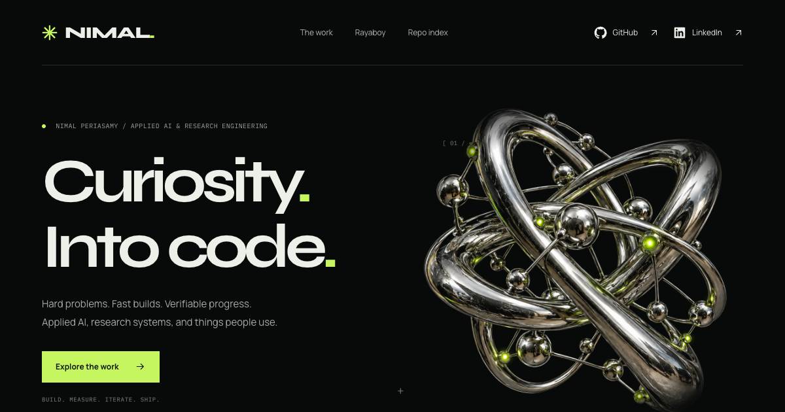
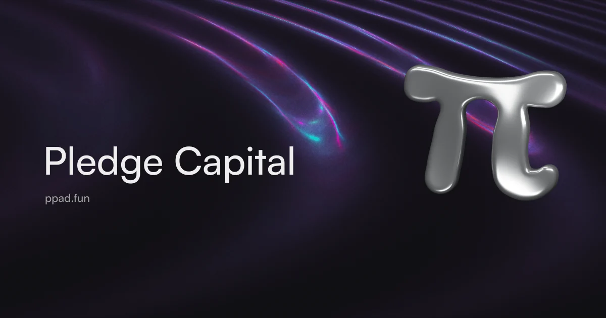
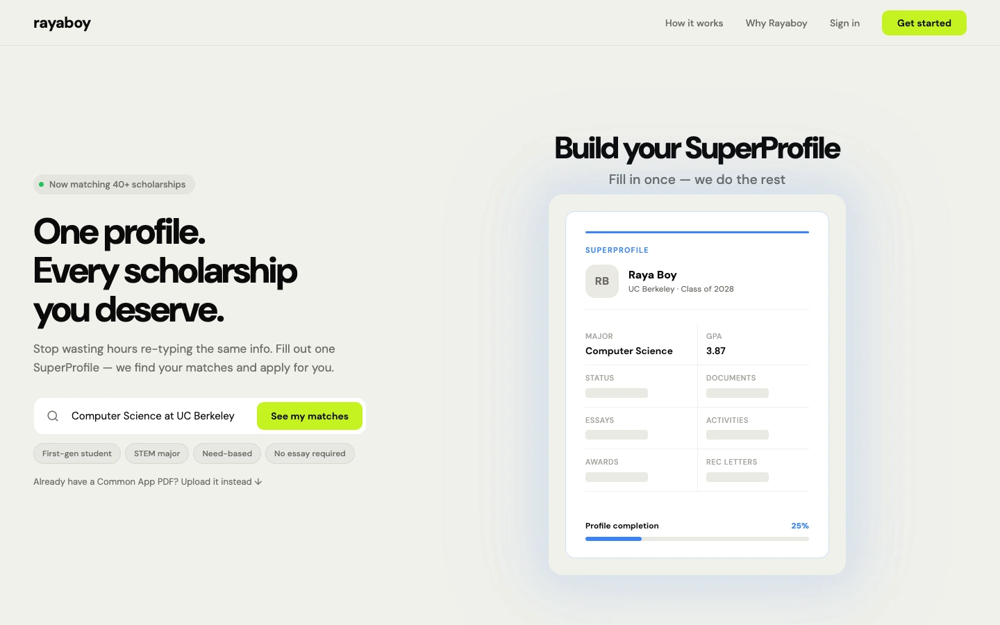
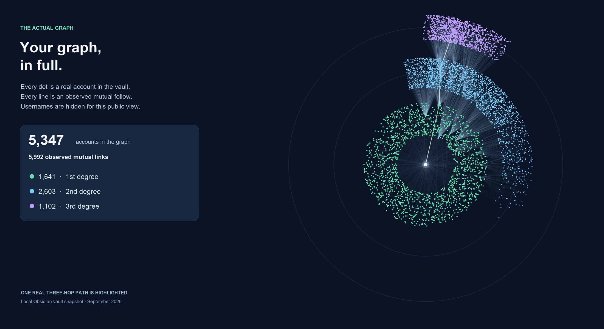

  <strong><a href="https://nimalp123.com/">ENTER THE SITE ↗</a></strong>
  &nbsp; / &nbsp;
  <a href="https://www.linkedin.com/in/nimal-periasamy/">LinkedIn ↗</a>
  &nbsp; / &nbsp;
  <a href="https://github.com/nimalp123">GitHub ↗</a>
  &nbsp; / &nbsp;
  <a href="https://ppad.fun">PPAD ↗</a>
  &nbsp; / &nbsp;
  <a href="https://rayaboy.com">Rayaboy ↗</a>

<strong>Hard problems. Fast builds. Verifiable progress.</strong> Applied AI, research systems, and things people use.

---

`01 / PPAD — FULL-STACK + PROTOCOL ENGINEERING`

## Pledge Capital

**From interface to infrastructure. Built with my team.**

Token launches. Creator fee sharing. Collateral-backed lending on Solana. Built with my team, from interface to protocol.

**[OPEN PPAD.FUN ↗](https://ppad.fun)** · [Official $PPAD token ↗](https://solscan.io/token/2Pj812u3RsfRT3mirFNNdGXZBMSFFnMjw6EjF7iwc1Ev)

| **393** | **36** | **39** |
| :--- | :--- | :--- |
| Recorded release tests | Compiled-program tests | Reconciled test transactions |

Previously published engineering checkpoints. Separate test scopes; validator transactions are test activity. [Receipt notes ↗](PPAD-RESULTS.md)

- **Launch, end to end:** artwork → wallet approval → token creation → optional first buy. Creator fee sharing with an immutable, wallet-approved split.
- **Capital, on-chain:** individually funded SOL offers, fixed repayment terms, and token collateral returned on repayment or delivered to the lender at default.
- **Make it inspectable:** accounts, terms, fees and expiry reviewed before signing. Public market APIs and linked transaction receipts.

**On-chain / fees received**

| **23.929338253 SOL** | **0.04 SOL** | **24** |
| :--- | :--- | :--- |
| Creator fees received | Launch fees received | Finalized fee transactions |

October 1 treasury inflows from the public finalized fee ledger. [Open the receipts ↗](https://ppad.fun/api/launch/fees)

<strong>Inside the build ↗</strong>

| Layer | What we built |
| :--- | :--- |
| Launch workspace | Artwork and metadata, an optional first buy, disclosed costs, and a separate wallet review |
| Creator fee sharing | Creator-selected percentages, immutable recipients, and direct Pump payouts |
| Lending lifecycle | Fund an offer → pledge tokens → repay to unlock collateral, or settle to the lender at default |
| Wallet review | Verify accounts, exact terms, fees and expiry; reconcile an uncertain signature before another transaction |
| Public data | Read-only APIs for release status, admitted mints, markets, funded offers, loan records and treasury snapshots |
| Treasury receipts | Creator fees and launch fees tracked separately, with exact SOL amounts and transaction links |
| Product | Launches, Lending and My vault — token creation, financing and wallet positions |
| Published engineering | Rust / Anchor + TypeScript, compiled-program checks, and reconciled validator runs |

**Explore the product:** wallet-approved launches, creator fee sharing, and fixed-term SOL financing at **[ppad.fun ↗](https://ppad.fun)**.

---

`02 / RAYABOY — APPLIED AI + PRODUCT`

## Rayaboy

**Build fast. Prove it.**

**Research engineering → real product.**

| The product | The AI systems | The research infrastructure |
| :--- | :--- | :--- |
| SuperProfile | Browser research | Controlled experiments |
| Document → profile | Document intelligence | Isolated workers |
| Writing hub | Evidence verification | Model-free capture |
| Review + export | Human feedback | Restartable runs |

### My work / the receipts

| Result | What it measured |
| :--- | :--- |
| **3.3×** observed batch throughput | 93 → 28 minutes, same six real development pages; same terminal outcomes |
| **78%** fewer invalid AI proposals | 45 → 10, same experimental arm and 12-case synthetic benchmark |
| **83%** fewer output tokens | 963k → 163k, controlled 12-case baseline/tuned-arm comparison |
| **22%** shorter evaluation runtime | 64 → 50 minutes in that baseline/tuned-arm comparison |
| **6 → 11 / 12** exact matches | Initial/final runs, same arm and synthetic fixtures |
| **12 / 12** passed verification | Up from 10/12 on the same synthetic benchmark |
| **20 / 20** repeated document trials | 470/470 required fields matched on an already-seen synthetic set |
| **539 / 539** selected course cells exact | 77/77 rows, each of two trials on one real development template |
| **9,600** passing unit checks | September 30 scraper development checkpoint; 347 skipped |
| **137** review-driven regression cases | Recorded document-pipeline correction following independent review |

<strong>More from the lab ↗</strong>

| Checkpoint | Recorded result |
| :--- | :--- |
| Document research | **231** tracked model calls across PR55 development, comparison, and validation |
| Offline source checks | **3,289** passed: 1,834 backend/core + 1,455 app |
| Controlled response fixtures | **299**, exercised by 151 focused tests, including rejection cases |
| Frozen replay probes | **167**; **79/79** legacy outputs unchanged |
| Labeled-condition retention | **98.8%**: 251/254 reference-recorded labels present in model-free captures; same 97 development cases |
| Start-page agreement | **98.7%**: 78/79 start comparisons matched between model-free and reference recordings |
| Discovery research | **86** entries with readable real-web captures |
| Saved source readings | **133**: 117 HTML + 16 PDF texts |
| Research corpus | **19,977** source units cataloged for evaluation |
| Artifact validation | **95/97** recordings admitted in the original campaign; two failures retained |
| Browser isolation | **0** leaked processes across three repeated crash/cancel/deadline test cycles |

Recorded September 2026 development experiments and engineering checkpoints. Each result keeps its test scope; the figures describe separate runs and overlapping suites. [Read the measurement notes ↗](RESEARCH-SNAPSHOTS.md)

### Fast cycles. Hard checks.

**Hypothesis → candidate → independent frontier-model review → verifiable test → repeat.**

`FIXED INPUTS` · `VERSIONED ARTIFACTS` · `HELD-OUT EVALUATIONS` · `FAILURES → REGRESSIONS`

### Rayaboy / the outcome

**One profile. A world of opportunity.**

**[CLICK THE PREVIEW OR OPEN RAYABOY.COM ↗](https://rayaboy.com)**

| **100** | **40+** | **$336k** |
| :--- | :--- | :--- |
| Registered accounts | Scholarships in the catalog | Listed scholarship funding |

September 29, 2026 snapshots. Accounts include admin, unverified, and retained test registrations. Funding is listed scholarship value. [See the live registration counter ↗](https://nimalp123.com/#rayaboy)

---

`INSTAGRAM / THE PUBLIC EXPERIMENT`

## Mapped. Still curious.

### Instagram Friendship Graph

**A completed mapping experiment. A starting point for bigger questions.**

I mapped my Instagram network into an explorable Obsidian vault. Mutual follows, shared connections, and paths across three degrees.

| **5,347** | **5,992** | **3°** |
| :--- | :--- | :--- |
| Anonymous accounts | Observed mutual-follow links | Degrees of connection |

September 2026 snapshot. Second and third degree totals are observed lower bounds. Names stay private.

**The graph is built. The questions keep coming.**

- Who could I become friends with?
- Which mutuals connect us?
- Who might I click with?
- What patterns am I missing?

**[Explore the experiment ↗](https://github.com/nimalp123/instagram-friendship-graph)** · [Try the interactive network ↗](https://nimalp123.com/#work)

---

`03 / THE PUBLIC ARCHIVE`

## A few builds. More questions.

| Aura order | Project | The experiment |
| :--- | :--- | :--- |
| **01** | [Instagram Friendship Graph ↗](https://github.com/nimalp123/instagram-friendship-graph) | A completed graph. More analysis to explore. |
| **02** | [Trading algorithms ↗](https://github.com/nimalp123/tradingAlgos) | Trading programs and stock-data analysis. |
| **03** | [FoodConnect ↗](https://github.com/nimalp123/FoodConnect) | An early Python build. |
| **04** | [Mediquery ↗](https://github.com/nimalp123/mediquery) | An early Python experiment. |

Ordered by aura. Completely subjective. Completely intentional.

---

## Got a good idea?

**[See the work ↗](https://nimalp123.com/)** · **[Find me on LinkedIn ↗](https://www.linkedin.com/in/nimal-periasamy/)** · **[@nimalp123 ↗](https://github.com/nimalp123)**

✳ NIMAL. — BUILD. MEASURE. ITERATE. SHIP.
